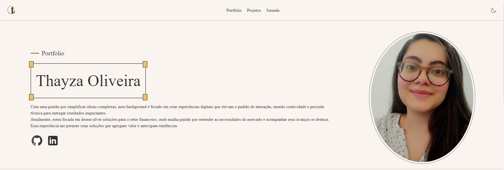

# Meu Portfólio ⭐

Este projeto reúne uma seleção dos principais trabalhos que desenvolvi e conquistas ao longo da minha jornada no mundo tech.

🔗 [Acesse o portfólio aqui](https://portfolio-phi-eight-46.vercel.app/)



## 📋 Visão Geral

O portfólio foi desenvolvido com foco em boas práticas de desenvolvimento, acessibilidade e design responsivo. Ele reflete meu interesse por soluções simples, elegantes e funcionais.

## 🛠️ Tecnologias Utilizadas

- **Angular**: Framework para construção de aplicações front-end modernas e componentizadas.
- **SASS**: Pré-processador CSS para melhor organização e reuso de estilos, utilizando mixins e functions.
- **TypeScript**: Para tipagem estática e manutenção robusta do código.

## ✨ Funcionalidades

- **Tema Dark-Light**: Personalização da aparência para melhor experiência do usuário.
- **Layout Responsivo**: Adaptável a diferentes dispositivos e tamanhos de tela.
- **Componentização**: Estrutura modular para facilitar a manutenção e a escalabilidade.

## 🚀 Como Executar Localmente

1. Clone este repositório:
   ```bash
   git clone https://github.com/seu-usuario/seu-portfolio.git
   ```
2. Navegue até a pasta do projeto:
   ```bash
   cd portfolio
   ```
3. Instale as dependências:
   ```bash
   npm install
   ```
4. Execute o projeto:
   ```bash
   ng serve
   ```
5. Acesse http://localhost:4200 no navegador.

## 📈 Melhorias Futuras

- **Adicionar novos projetos e funcionalidades**: Continuar expandindo o portfólio para refletir novas habilidades e experiências.
- **Implementar melhorias de performance e animações interativas**: Tornar a navegação mais fluida e aprimorar a experiência do usuário com transições suaves.

## 📝 Licença

Este projeto é de uso pessoal e não está licenciado para uso comercial ou redistribuição.
